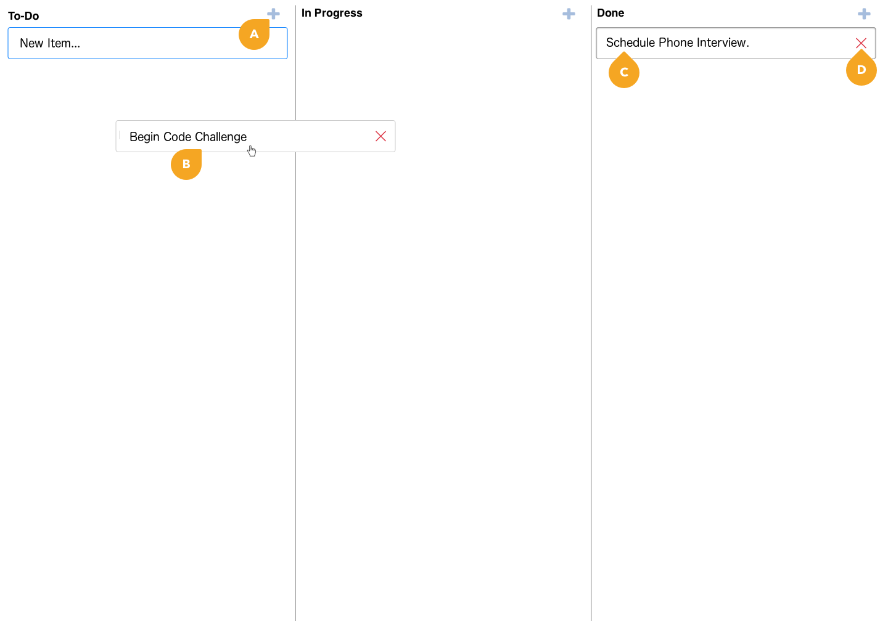

# Frontend code challenge

Create a single page application using [React](https://reactjs.org).

## (Mini)Kanban board

Manage tasks using a simplified workflow to track their progress. Main functionalities:

**A.** Add tasks in any column

**B.** Drag items to set the status

**C.** Double click in an item to edit

**D.** Remove item from the board

## Challenge delivery

Some nice to have features:

- Persist tasks between browser refreshes

- CSS animation when saving task description

- Add labels to tasks

- Show the date and time of the last task update

- Search functionality

To deliver you test, push your code to this repository and let the person that send you the test know you're done.
